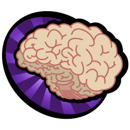

**Kodlar inanılmaz derecede kirli, hiç bir design pattern kullanılmamış. Giriş seviyesindeki arkadaşlar için bir nebze daha kolay anlaşılır**

# BeyinJimnastiği
[](https://twitter.com/beyinjim)


BeyinJimnastiği interaktif bir Twitter hesabıdır. [**Demo hesap için tıklayınız**](https://twitter.com/beyinjim)


Çalışma mantığı şu şekildedir : 
  - Rastgele matematik problemi oluştur
  - Tweet gönder
  - Doğru yanıtı bekle ve **doğru yanıt geldiğinde bu işlemi tekrarla**

[](https://twitter.com/BeyinJim/status/536876598818242561)

### Neler gerekli

BeyinJimnastiği oldukça basit tasarlanmıştır. Kullanmak için **node.js** kurulu bir  ortam ve **yazma izini olan bir Twitter uygulaması** gerekmektedir.

### Kurulum

 - Projeyi clonelayın
 - Config dosyasını düzenleyin
 - Proje klasöründe alttaki kod bloğunu çalıştırarak gerekli paketleri indirin


```sh
$ npm install
```

### Yapılacaklar listesi

 - Yeni problem türleri eklenecek
 - **Veritabanı eklenecek ve gelen doğru cevaplar bir puan tablosu şeklinde tutulacak**
 - **Web arayüzü yapılıp puan tablosu canlı olarak listelenecek**


*Doğru düzgün hata yönetimi vs. yoktur, boş zaman projesidir*

[Twit]:https://github.com/ttezel/twit
